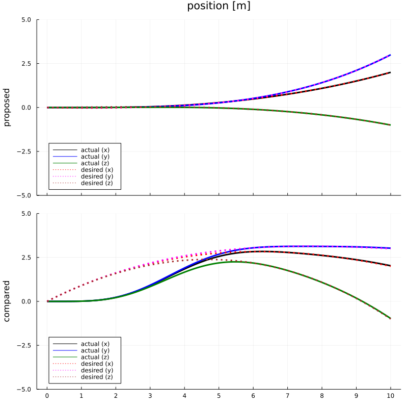
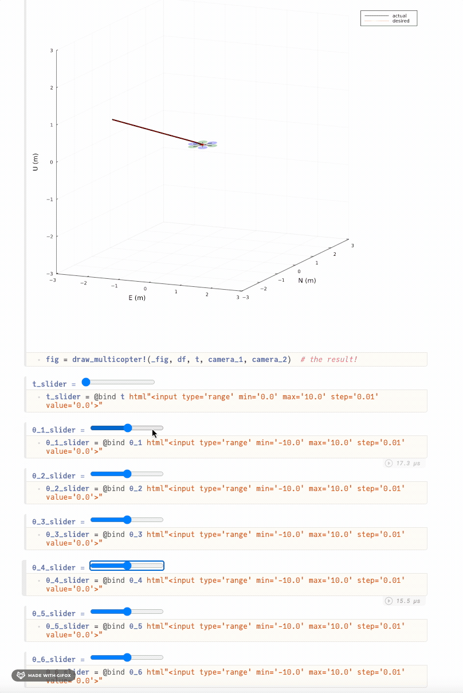

# KSAS2021Fall

This code base is using the Julia Language and [DrWatson](https://juliadynamics.github.io/DrWatson.jl/stable/)
to make a reproducible scientific project named
> KSAS2021Fall

It is authored by JinraeKim.

To (locally) reproduce this project, do the following:

0. Download this code base. Notice that raw data are typically not included in the
   git-history and may need to be downloaded independently.
1. Open a Julia console and do:
   ```
   julia> using Pkg
   julia> Pkg.add("DrWatson") # install globally, for using `quickactivate`
   julia> Pkg.activate("path/to/this/project")
   julia> Pkg.instantiate()
   ```

This will install all necessary packages for you to be able to run the scripts and
everything should work out of the box, including correctly finding local paths.

2. Type `using KSAS2021Fall` in your Julia REPL.

    2-1. Run `main()` to see the entire simulation results including trajectory data sampling and training approximators.

    2-2. Run `notebook.jl` in Pluto session as the following code. It will take a bit long time...
    ```julia
    import Pluto
    Pluto.run()
    # in the Pluto session, move sliders for interactive plotting
    ```

## Example
### Trajectory generation and tracking example


### Interactive simulation (nearly real-time!)



## To-do list
- [x] Interactive plotting for presentation.
- [x] Add time slider and plot a multicopter figure
- [x] NED to ENU

## Notes
- (Private) For the private repo for conference papers, see [this repo](https://github.com/JinraeKim/KSAS2021Fall_Paper).
